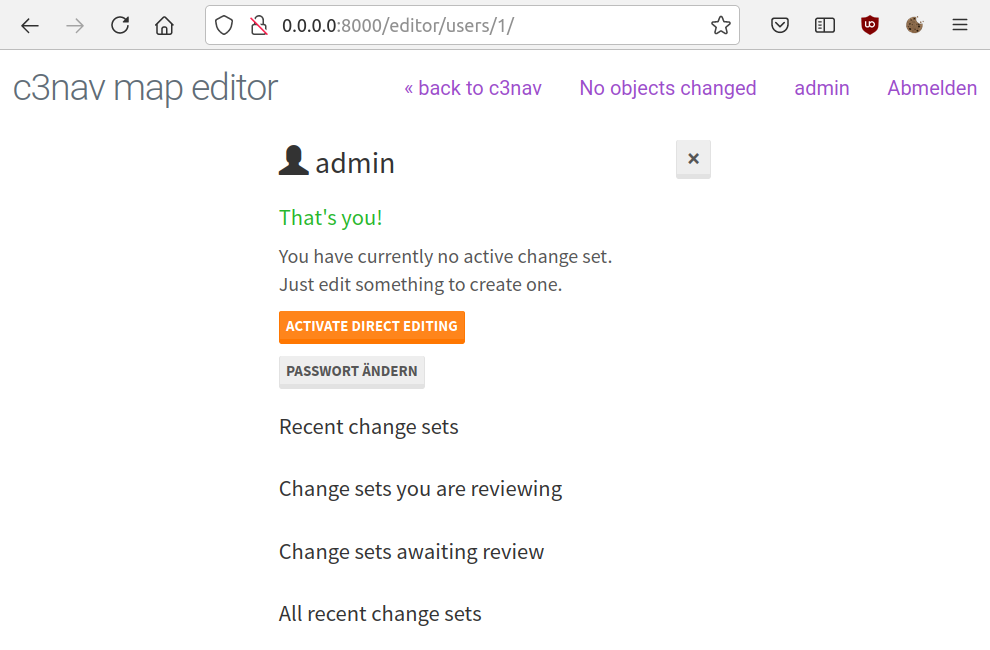

# c3nav

indoor navigation for events. See it live at [c3nav.de](https://c3nav.de/).

**Documentation for the current state will follow and is currently not available. Sorry. Please do not refer to old documentation and report bugs about it not being accurate.**

*Please note that this project is released with a [Code of Conduct](CODE_OF_CONDUCT.md) that applies to all project-related communication. By participating in this project you agree to abide by its terms.*

*You can support c3nav development [on Patreon](https://www.patreon.com/c3nav).*

There is documentation on [manual installation](doc/manual.md) that might be a little outdated.
You can also consult the [Dockerfile](Dockerfile) if you need help. 

# Run with Docker

You can run a local development server with docker.
To build the image run

```
docker build -t local/c3nav .
```

You can now run your image with 

```
docker run --rm -it  -p 8000:8000 -v $(pwd):/usr/share/c3nav --name c3nav local/c3nav
```

This creates a ubuntu container with all dependencies running on a sqlite database.
You can now reach your c3nav instance at [localhost:8000/](http://localhost:8000/). 
The editor can be found at [localhost:8000/editor/](http://localhost:8000/editor/).

You can enter the container console with:

```
docker exec -ti c3nav bash
```

To login in the webfrontend you have to create a superuser first with

```
root@4d4fcf24c986:/usr/share/c3nav/src# python3 manage.py createsuperuser
Username: admin
Email address: 
Password: 
Password (again): 
This password is too short. It must contain at least 8 characters.
This password is too common.
This password is entirely numeric.
Bypass password validation and create user anyway? [y/N]: y
Superuser created successfully.
```
Login with the superuser credentials and start editing your map.

When inside the container you can also run the usual django manage.py commands like

```
root@4d4fcf24c986:/usr/share/c3nav/src# python3 manage.py makemigrations
root@4d4fcf24c986:/usr/share/c3nav/src# python3 manage.py migrate
```

# Creating your first level
There is currently a bug in the code that throws an FOREIGN KEY error when creating a new level in changeset mode.
As a workaround you can activate direct editing mode before creating your levels.
When using the docker container there is no downside of using direct editing mode as you are the single user of the system.

To activate direct editing mode login with your user and click on your user name.
If you haven't already done changes contained in a changeset there should be a "Activate Direct Editing"-Button.
If not, click "Deactivate Changeset" to discard your changes. The button should now appear.



You can now create your first level by clicking "New Level" in the editor.
Fill in the neccessary information and click the save button.

You can now click on your newly created level in the editor to create your first building.


